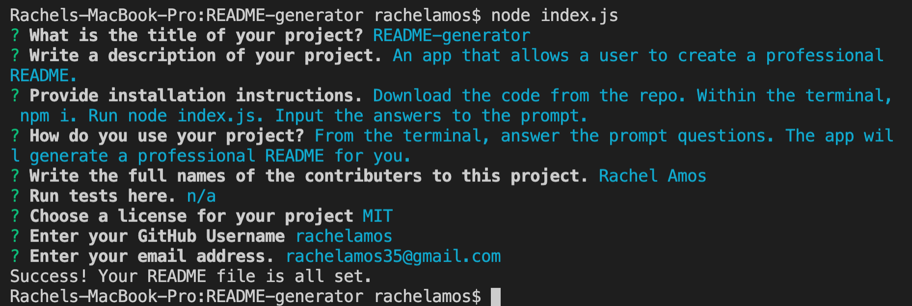
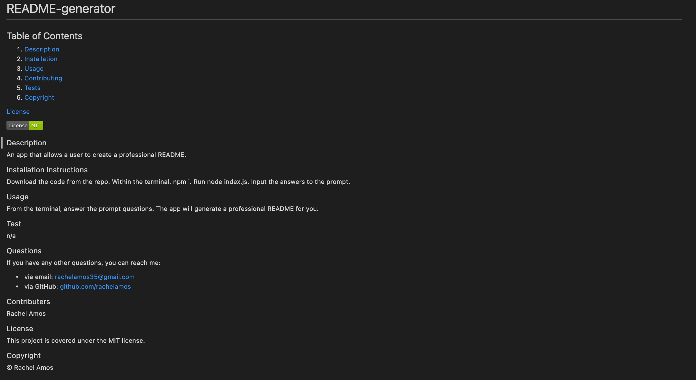

# README-generator
## Table of Contents

1. [Description](#description)
2. [Installation](#installation-instructions)
3. [Usage](#usage)
4. [Contributing](#contributers)
5. [License](#license)

### Description
An app that allows a user to create a professional README.

### Installation Instructions
1. Download the code from the repo.
2. Within the terminal, npm i.
3. Run node index.js.
4. Input the answers to the prompts.

### Usage
From the terminal, answer the prompt questions. The app will generate a professional README for you.

**Generator in Terminal**

**Final Product**

[Link to Application](https://github.com/rachelamos/README-generator.git)

[Demo of My Page](https://drive.google.com/file/d/163ykEheAxaouIHtQq82xtucj2MDa3sw2/view)

### Questions
If you have any other questions, you can reach me:
- via email: rachelamos35@gmail.com
- via GitHub: github.com/rachelamos

### License
This project is covered under the [MIT](LICENSE) license.

### Contributers
© Rachel Amos